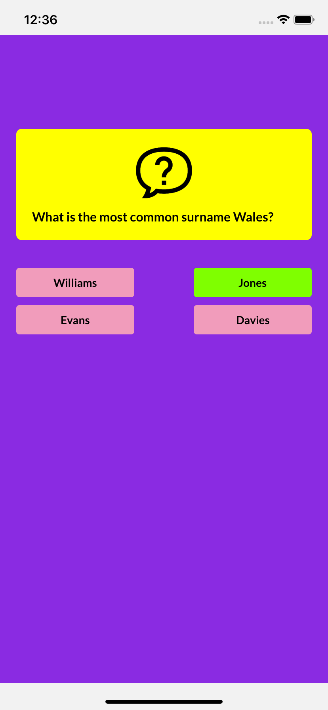

# Quizzes

  
  
  

## Clone 
* git clone `git clone https://github.com/RasikBhil/Quizzes.git`

## Installation
* Install npm packages with `npm install`

## iOS instructions
### if cocoa pods not installed
* [Install CocoaPods](https://cocoapods.org/)
* Then run `cd ios && pod install`
### if cocoa pods is already installed
*  run `cd ios && pod install`

## run on ios
* `yarn ios` or `npm run ios` or `npx react-native run-ios`

## run on android
* `yarn android` or `npm run android` or `npx react-native run-android`
